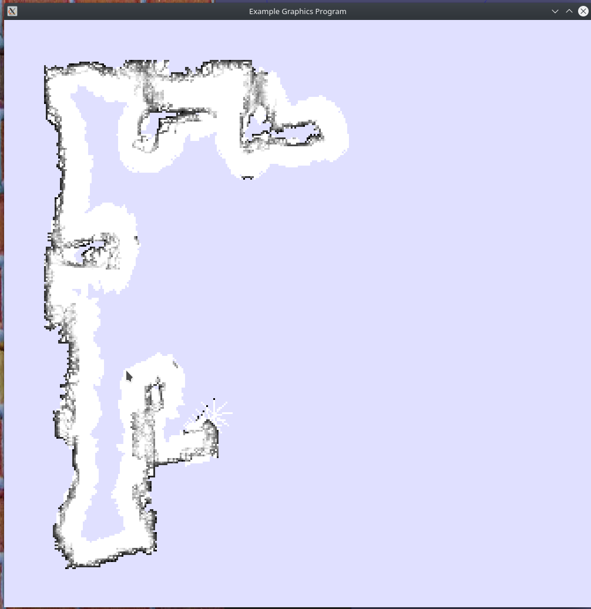

# Homework 6
**Thomas Kaunzinger**
*CS4610*

## YouTube Video
`https://youtu.be/x3uYSz39c6I`

## Comments
As I mention in the beginning of the video, the robot.cc starter
code is extremely buggy and has a tendancy to crash and stop
executing the callback in `do_stuff()`. As such, for this live demo
I have had to restart the control program a couple times close to
the beginning of the demo. After the second restart, the program
actually runs successfully for the entire requirements of the
homework, but to compensate, I have also provided a screenshot of
my solution getting even further along, but starting directly from
the beginning.

Also, please excuse the fact that my facecam partially covers the
solution at the beginning. This issue, like the starter code glitch,
is mitigated later in the video.

## Pull Request
`https://github.com/NatTuck/cs5335hw-gazebo/pull/9`

This pull request was a suggested solution to fix the initial buggy
error code that was way out of the initial assignment's scope (i.e.
position incorrect by +/- 1m). This issue has since been resolved
by Nat Tuck with a slightly different solution, but one mostly
achieves what my request fixed.

## Screenshot

